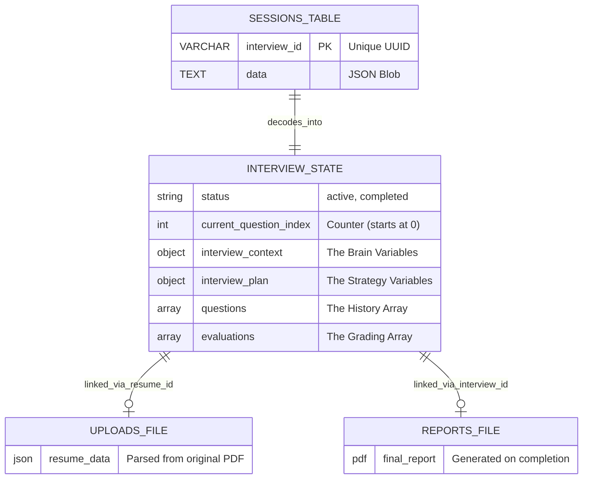

# InterviewAI: Complete System & Database Architecture

This document provides an exhaustive, granular breakdown of the InterviewAI platform. It details the complete technology stack, end-to-end system workflow, database architecture, and a comprehensive dictionary of every variable used across the system schemas.

---

## 1. Complete Technology Stack

The platform is divided into a decoupled client-server architecture.

### **Frontend (Client)**
*   **Framework:** Next.js 14 (App Router, Server-Side Rendering)
*   **Language:** TypeScript
*   **Styling:** Tailwind CSS
*   **State Management:** Zustand (for lightweight, fast real-time state during interviews)
*   **Audio Integration:** Native Web Speech API (SpeechRecognition for Mic, SpeechSynthesis for AI Voice)

### **Backend (Server)**
*   **Framework:** FastAPI (High-performance, async Python web framework)
*   **Language:** Python 3.12
*   **Server:** Uvicorn (ASGI server)
*   **Data Validation:** Pydantic (Strict typing for all JSON and database interactions)

### **Database & Storage**
*   **Database:** SQLite (Running in production with persistent disk storage)
*   **ORM:** SQLAlchemy (Handles database connections and session management)
*   **File Storage:** Local File System (JSON for resumes, PDFs for reports)

### **AI & Machine Learning**
*   **LLM Orchestrator:** Custom multi-provider router
*   **Primary Providers:** Google Gemini, Groq, DeepSeek
*   **Prompting Strategy:** Context-aware, dynamic difficulty adjustment (Zero-shot & Few-shot)

---

## 2. System Workflow: How It Works End-to-End

1.  **Onboarding (Upload Phase):**
    *   User uploads a PDF resume via the Frontend.
    *   Backend `/resume/upload` endpoint parses the PDF using an LLM to extract structured data.
    *   The backend saves the extracted data to the `/uploads/{resume_id}.json` file and returns the `resume_id` to the frontend.
2.  **Interview Initialization:**
    *   Frontend sends `resume_id`, `candidate_name`, and target `role` to `/interview/start`.
    *   Backend generates a custom `interview_plan` based on the resume.
    *   Backend creates a new record in the SQLite `sessions` table, storing the initial state as a JSON blob.
3.  **The Real-Time Interview Loop:**
    *   AI asks a question (Frontend uses SpeechSynthesis to speak it).
    *   User answers (Frontend uses SpeechRecognition to capture text).
    *   Frontend sends the answer to `/interview/answer`.
    *   Backend fetches the session from SQLite, sends the Answer + Context to the Evaluation LLM.
    *   LLM grades the answer, updates the `interview_context` (adjusting difficulty/topics), and generates the `next_question`.
    *   Backend updates the JSON blob in SQLite.
4.  **Finalization & Reporting:**
    *   Once `current_question_index` reaches the `total_planned` limit, the status changes to `completed`.
    *   The `ReportGenerator` scans the `evaluations` array.
    *   A final PDF is generated and saved to `/reports/{interview_id}.pdf`.

---

## 3. Database Architecture & Schema Diagram

**Important Architectural Note:** 
InterviewAI uses a **"Single-Table Document Store"** pattern. Because interview data is highly nested and variable (lists of questions, dynamic contexts, variable evaluations), a traditional relational SQL structure (with 10+ joined tables) would be too rigid and slow for real-time AI updates. 

Instead, the system uses a single physical SQL table (`sessions`) as an incredibly fast key-value store, while **Pydantic** enforces a strict "Virtual Schema" on the JSON data inside it.

### Database Schema Diagram (Mermaid)

---

## 4. Complete Database Tables (Physical Layer)

There is exactly **one** physical table in the SQLite database (`sessions.db`).

### Table: `sessions`
| Column Name  | SQL Type | Constraints          | Description                                                          |
| :----------- | :------- | :------------------- | :------------------------------------------------------------------- |
| interview_id | VARCHAR  | PRIMARY KEY, INDEXED | A unique UUID v4 generated when an interview starts.                 |
| data         | TEXT     | NOT NULL             | A serialized JSON string containing the entire state of the session. |

---

## 5. The "Virtual" Database Schema (JSON State Variables)

When the backend reads the `data` column, it deserializes it into the `InterviewState` Pydantic model. Here is **every single variable** stored inside that database column.

### Core Session Variables (`InterviewState`)
| Variable Name          | Data Type | Description                                              |
| :--------------------- | :-------- | :------------------------------------------------------- |
| interview_id           | string    | The UUID of the session (matches physical PK).           |
| resume_id              | string    | UUID linking to `/uploads/{resume_id}.json`.             |
| candidate_name         | string    | Name provided by the user.                               |
| role                   | string    | Target job (e.g., `sde_intern`, `data_analyst`).         |
| status                 | string    | Current state: `"active"`, `"paused"`, or `"completed"`. |
| current_question_index | int       | Tracks how many questions have been asked (starts at 0). |
| created_at             | string    | ISO 8601 timestamp of creation.                          |
| updated_at             | string    | ISO 8601 timestamp of last DB write.                     |

### The "Brain" Variables (`interview_context` object)
This object updates dynamically after every answer, guiding the LLM's next move.

| Variable Name      | Data Type | Description                                                               |
| :----------------- | :-------- | :------------------------------------------------------------------------ |
| resume_summary     | string    | A highly compressed summary of the user's resume.                         |
| topics_covered     | list[str] | Array of topics already asked (prevents repetition).                      |
| strong_topics      | list[str] | Topics where user scored high (guides AI to harder questions).            |
| weak_topics        | list[str] | Topics where user struggled.                                              |
| remaining_topics   | list[str] | Topics planned but not yet asked.                                         |
| current_difficulty | string    | `"easy"`, `"medium"`, `"hard"`. Adjusts based on user performance.        |
| last_question      | string    | Text of the immediate previous question.                                  |
| total_planned      | int       | Target number of questions for the session (usually 12).                  |

### The Strategy Variables (`interview_plan` object)
Generated once at the start of the interview.

| Variable Name          | Data Type | Description                                                            |
| :--------------------- | :-------- | :--------------------------------------------------------------------- |
| topics                 | list[str] | All topics extracted from the resume to test.                          |
| difficulty             | string    | Starting difficulty level.                                             |
| estimated_questions    | int       | Total questions planned.                                               |
| focus_areas            | list[str] | Broad categories (e.g., `["Technical Skills", "Problem-Solving"]`).    |
| opening_question_topic | string    | The topic chosen for the very first question.                          |

### History Variables (`questions` array of objects)
Logs the actual conversation.

| Variable Name      | Data Type | Description                                      |
| :----------------- | :-------- | :----------------------------------------------- |
| question           | string    | The text the AI asked.                           |
| answer             | string    | The text the user replied with (via voice).      |
| time_taken_seconds | int       | How long the user took to answer.                |

### Grading Variables (`evaluations` array of objects)
Stores the AI's grading for *every single answer* in the `questions` array.

| Variable Name       | Data Type   | Description                                                            |
| :------------------ | :---------- | :--------------------------------------------------------------------- |
| technical_score     | int (1-10)  | Accuracy and depth of the technical answer.                            |
| communication_score | int (1-10)  | Clarity and conciseness of the answer.                                 |
| confidence_score    | int (1-10)  | Derived from hesitation, filler words, and speed.                      |
| answer_quality      | string      | `"Excellent"`, `"Good"`, `"Fair"`, `"Poor"`.                           |
| missing_concepts    | list[str]   | Array of keywords/concepts the user failed to mention.                 |
| follow_up_required  | bool        | True if the AI feels the user needs to elaborate.                      |
| difficulty_change   | string      | `"increase"`, `"maintain"`, `"decrease"`. Drives `current_difficulty`. |
| topic               | string      | The specific topic this question tested.                               |
| next_question       | string      | The subsequent question generated by the LLM.                          |
| feedback            | string      | Constructive criticism provided to the user.                           |

---

## 6. System Configuration Variables (Environment)

Loaded via `.env` or Render Dashboard into the `config.py` `Settings` class.

| Variable Name    | Description                                                                    |
| :--------------- | :----------------------------------------------------------------------------- |
| GEMINI_API_KEY   | (Secret) Primary LLM authentication token.                                     |
| GROQ_API_KEY     | (Secret) Secondary LLM token for fast inference.                               |
| DEEPSEEK_API_KEY | (Secret) Tertiary LLM token.                                                   |
| MAX_FILE_SIZE_MB | Integer (e.g., 5). Hard limit on upload endpoints.                             |
| SESSION_DIR      | String (e.g., `sessions`). Maps the DB to persistent storage.                  |
| UPLOAD_DIR       | String (e.g., `uploads`). Maps raw JSON files to storage.                      |
| REPORT_DIR       | String (e.g., `reports`). Directory for generated PDFs.                        |
| CORS_ORIGINS     | Comma-separated list of allowed frontend URLs (e.g., `http://localhost:3000`). |
| PORT             | Dynamic port assigned by the hosting provider (Render).                        |
